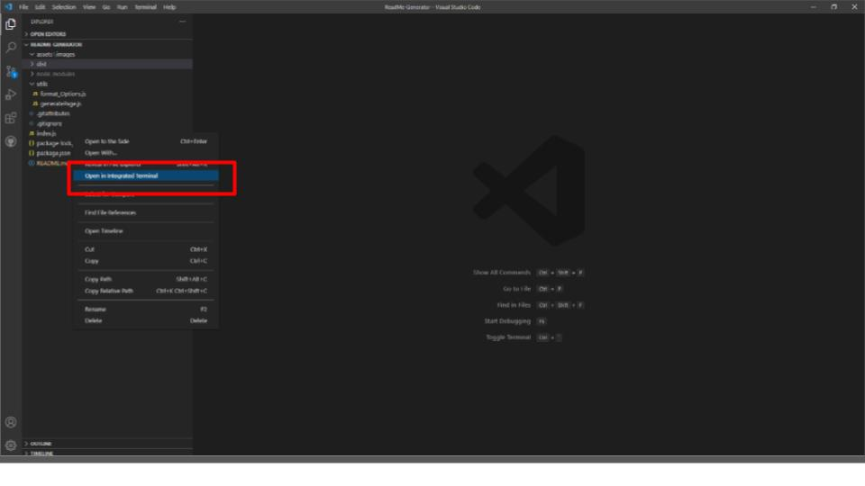
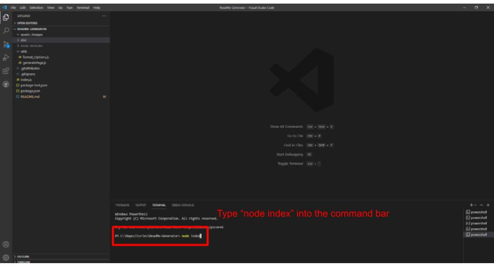
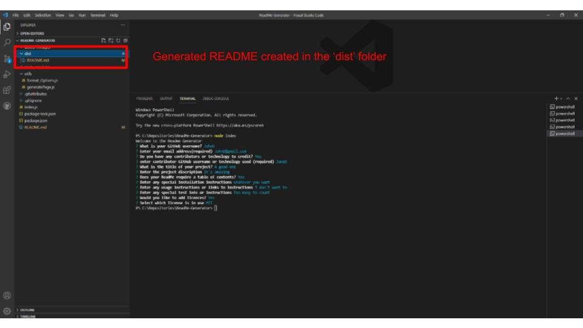
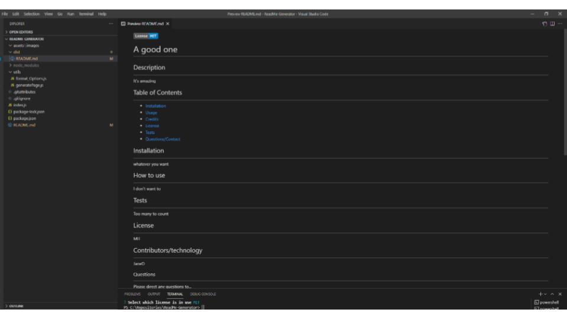

# Professional-README-Generator

  ## Description 
  
  Create a simple and professional README file for whatever project you're working on. Using npm Inquirer prompts, input data about your project.
  
  ## Usage 
  
  Clone repository to your workstation. Using the integrated vs terminal, enter "node index" to begin answering prompts in the command line.
  The new README.md will appear in the 'dist' repository

  How-to Slides
  ---
  
  
  
  

  link to a how to use video here https://drive.google.com/file/d/1QtYsrJ7hOOOlfoKXzxbtCS1q0o8JX4zO/view

  ## License
  
  mit
  
  ## Questions?
If you have any questions on the project or wish to contribute, contact me at:
GitHub: [@LincW90](https://api.github.com/users/LincW90)
Email: Lincoln.t.weiss@gmail.com